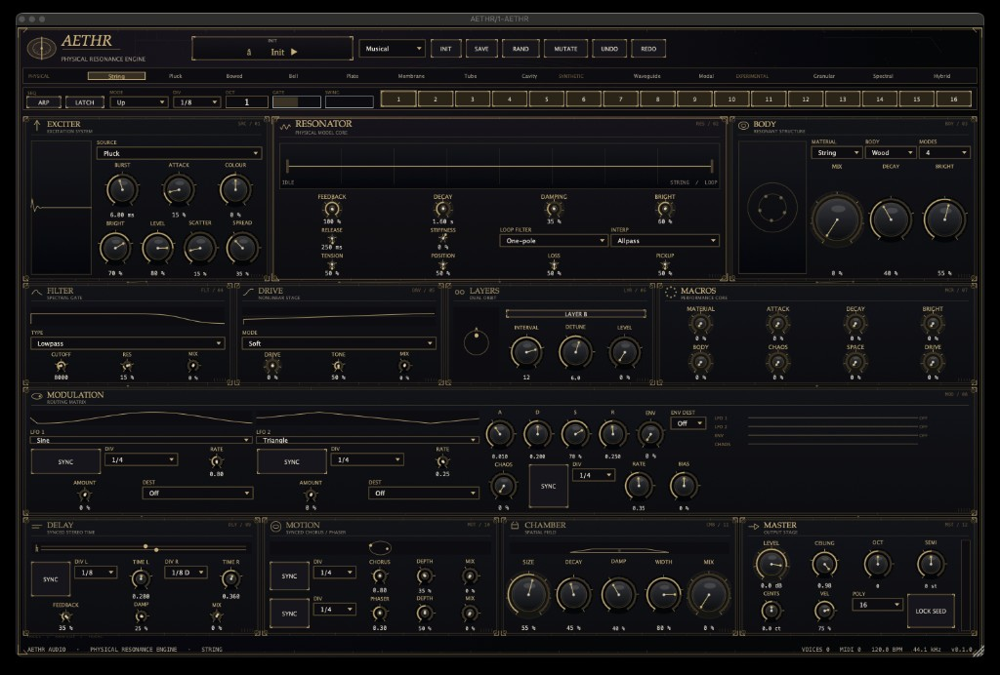

# AETHR — Physical Resonance Engine

[](https://github.com/Soumen2581/AETHR/actions/workflows/ci.yml)
[](https://github.com/Soumen2581/AETHR/actions/workflows/release.yml)

A polyphonic physical-modelling instrument by **ixmuk**.
Formats:

| Platform | Formats |
|----------|---------|
| **macOS** | VST3, Audio Unit, Standalone |
| **Windows** | VST3, Standalone |

Company: **ixmuk**. CI builds and tests both platforms on every push
([docs/CI.md](docs/CI.md)).

**Install:** end users — **[docs/INSTALLATION.md](docs/INSTALLATION.md)** (DMG / EXE).
Developers / CI zips — **[docs/INSTALL.md](docs/INSTALL.md)**.

AETHR is an experimental synthesis lab: thirteen selectable engines in one chassis —
physical (string through cavity), synthetic (waveguide / modal / spectral), and
experimental (granular / hybrid) — sharing Karplus–Strong and modal cores with
per-engine character, plus a tempo-synced arpeggiator / 16-step sequencer.

See [`docs/ENGINE_REFERENCE.md`](docs/ENGINE_REFERENCE.md) for what each engine
actually does (character models on two cores, not thirteen unrelated physics
simulators).



## Repository layout

```
Source/
  Core/         Maths, branding, realtime guards, tempo sync
  DSP/          Resonators, exciter, body, FX, modulation
  Engine/       Voices, engine catalogue, arp, modal / KS cores
  Parameters/   Stable parameter IDs and layout
  Presets/      Factory presets and randomisation
  UI/           Editor chrome, visualisers, engine / arp strips
Tests/          Catch2 suite (pitch, DSP, processor, engines)
Tools/          macOS sanitise + pluginval fetch helpers
cmake/          First-party warning policy
docs/           Architecture, DSP, engines, build, roadmap, UI screenshot
External/       JUCE / Catch2 (fetched at configure — not committed)
build/          Local build output (ignored)
```

## Building

```bash
cmake --preset dev
cmake --build --preset dev
ctest --preset dev
```

Requires CMake ≥ 3.25 and a C++23 compiler. JUCE 9.0.1 and Catch2 v3.9.1 are
fetched automatically at pinned tags. Details: [`docs/BUILD.md`](docs/BUILD.md).

## Engines

| Family | Engines |
|--------|---------|
| Physical | String, Pluck, Bowed, Bell, Plate, Membrane, Tube, Cavity |
| Synthetic | Waveguide, Modal, Spectral |
| Experimental | Granular, Hybrid |

STRING (index 0) is the pitch-accurate Karplus–Strong default (±1 cent A0–C8 in
clean settings). Other engines are distinct character models — see
[`docs/ENGINE_REFERENCE.md`](docs/ENGINE_REFERENCE.md).

## Documentation

| Document | Contents |
|----------|----------|
| **[INSTALL.md](docs/INSTALL.md)** | **How to install on macOS and Windows (dev / CI zips)** |
| **[INSTALLATION.md](docs/INSTALLATION.md)** | **End-user DMG / EXE installers** |
| **[PACKAGING.md](docs/PACKAGING.md)** | **How installers are built** |
| **[CI.md](docs/CI.md)** | **GitHub Actions, local≈CI, releases, artefacts** |
| **[RELEASE.md](docs/RELEASE.md)** | **0.95 feature freeze + RC checklist** |
| **[FINAL_POLISH_AUDIT.md](docs/FINAL_POLISH_AUDIT.md)** | Final polish issue ranking |
| [ARCHITECTURE.md](docs/ARCHITECTURE.md) | Toolchain, signal flow, threading, parameters |
| [DSP_ARCHITECTURE.md](docs/DSP_ARCHITECTURE.md) | Multi-engine contract and realtime rules |
| [DSP_NOTES.md](docs/DSP_NOTES.md) | Loop tuning, filters, decay, dispersion maths |
| [ENGINE_REFERENCE.md](docs/ENGINE_REFERENCE.md) | Per-engine cores, controls, arp IDs |
| [PHYSICAL_MODELS.md](docs/PHYSICAL_MODELS.md) | Model notes |
| [BUILD.md](docs/BUILD.md) | Presets, options, packaging |
| [TESTING.md](docs/TESTING.md) | Coverage and methodology |
| [ROADMAP.md](docs/ROADMAP.md) | Phase history and next gates |
| [RISKS.md](docs/RISKS.md) | Risk register |
| [PERFORMANCE.md](docs/PERFORMANCE.md) | Profiling policy |
| [PRESET_DESIGN.md](docs/PRESET_DESIGN.md) | Preset / macro design |

## Design constraints

- `processBlock` never allocates, locks, logs, touches the filesystem, or calls UI.
- No non-finite sample reaches the host; recursive state stays finite.
- Parameter IDs are permanent — renaming breaks automation in saved sessions.
- Pitch / decay maths uses `double`; fast-math is never enabled.

## License / branding

Product identity lives in CMake cache variables at the top of `CMakeLists.txt`
(`AETHR_PRODUCT_NAME`, `AETHR_COMPANY_NAME`, …) and `Source/Core/Branding.h`.
